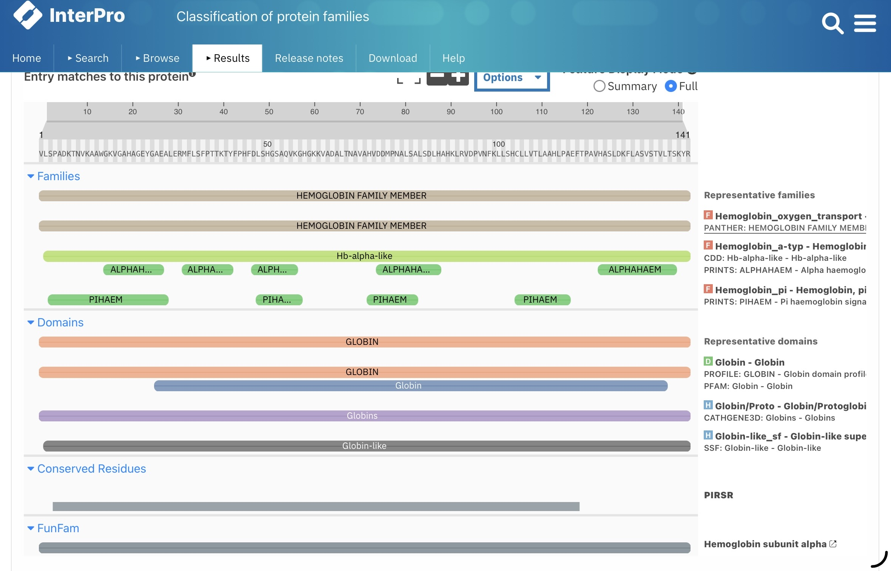

# Protein Domain Analysis of Hemoglobin Alpha Chain

## 📌 Overview
This project explores protein domain analysis of the human hemoglobin alpha chain using InterPro to identify functional domains and conserved regions associated with protein function.

## 🔬 Method
- Tool used: InterPro
- Input: Human hemoglobin alpha protein sequence
- Analysis of:
  - Protein families
  - Functional domains
  - Conserved regions

## 📊 Key Findings
- The protein was identified as part of the hemoglobin family
- A well-defined globin domain was detected across the sequence
- Multiple databases confirmed the domain annotation
- Conserved residues associated with structural and functional importance were identified

## 🧠 Biological Interpretation
The identified globin domain confirms the protein’s role in oxygen binding and transport. Conserved regions further support the biological importance of hemoglobin and demonstrate how protein domain analysis can help infer protein function from sequence data.

## 🛠 Skills Demonstrated
- Protein domain analysis
- Functional annotation
- Interpretation of conserved regions
- Bioinformatics database usage
- Sequence-based functional prediction

## 📁 Project Files
- PDF report with detailed explanation
- InterPro analysis screenshot

## 📸 InterPro Output

![InterPro Output](interpro_output
# Protein Domain Analysis of Hemoglobin Alpha Chain

## 📌 Overview
This project explores protein domain analysis of the human hemoglobin alpha chain using InterPro to identify functional domains and conserved regions associated with protein function.

## 🔬 Method
- Tool used: InterPro
- Input: Human hemoglobin alpha protein sequence
- Analysis of:
  - Protein families
  - Functional domains
  - Conserved regions

## 📊 Key Findings
- The protein was identified as part of the hemoglobin family
- A well-defined globin domain was detected across the sequence
- Multiple databases confirmed the domain annotation
- Conserved residues associated with structural and functional importance were identified

## 🧠 Biological Interpretation
The identified globin domain confirms the protein’s role in oxygen binding and transport. Conserved regions further support the biological importance of hemoglobin and demonstrate how protein domain analysis can help infer protein function from sequence data.

## 🛠 Skills Demonstrated
- Protein domain analysis
- Functional annotation
- Interpretation of conserved regions
- Bioinformatics database usage
- Sequence-based functional prediction

## 📁 Project Files
- PDF report with detailed explanation
- InterPro analysis screenshot

## 📸 InterPro Output

